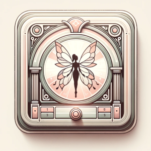

<div align="center">



# Fairybox

_Igniting children's imagination with tactile, screen-less storytelling and music._

</div>

<div align="center">

[](./LICENSE)

</div>

---
_Fairybox_ is an open-source audio player designed specifically for the Raspberry Pi
platform, that aims to place the audio and imagination at center stage.


Unlike modern devices, _Fairybox_ operates without a screen and is powered by RFID
cards or tokens, making it an ideal, interactive audio experience for kids.

## Background

In today's digital age, screen time is a significant concern for parents
worldwide. Excessive use of phones and tablets has been linked to various
negative impacts on children's development and well-being.

Fairybox offers a delightful alternative, promoting auditory learning and
imaginative play through a tangible, interactive medium.

By eliminating screens and simplifying controls, Fairybox encourages more
natural, explorative interaction with technology, nurturing creativity and
listening skills in young minds.

In my own childhood, the simple joy of playing and listening to stories and
music on cassette tapes was a formative experience. The tangible interaction of
inserting a tape, pressing play, and flipping sides to continue the adventure
engaged both the mind and the senses.

With Fairybox, I've tried to recapture this tactile and auditory experience for
my children. Just as I once eagerly anticipated the physical flip of a cassette
to unveil the story's next chapter, my children can experience a similar thrill
by swapping cards to discover new tales and tunes.

## Technical Info

- **Platform**: Raspberry Pi 4
- **Features**:
  - Screen-free interaction
  - Battery-powered for portability
  - Simple GPIO button controls for power, playback, and volume
  - Uses MFRC 522 RFID reader for contactless card or token detection
  - Operable totally offline, with an optional web interface for parental control
- **Technology Stack**:
  - Programmed in Clojure for a robust, all-in-one backend
  - Deployable via Nix, ensuring a consistent, self-contained environment
- **Web Interface**: Available for managing playback and settings, enhancing parental control over the content and device usage.

## Photo Gallery

_Photos coming soon._

## Build Instructions

Pre-reqs:

* Java JDK 17+
* Babashka
* Clojure

```bash
bb uberjar
```


# Development

Running and developing Fairybox requires a raspberry pi.

But we don't want to edit on the Raspberry PI, so we use a remote nrepl and a sync script.

On your raspberry pi clone this repo, then start the remote repl with:

``` bash
bb remote-repl
```

This will load up (it takes awhile) and expose an nrepl port on port `7002`. Using your editor of choice, connect to `RASPBERRYPI_IP_ADDRESS:7002`, and you're connected.

Once connected open the [`env/dev/clj/user.clj`](./env/dev/clj/user.clj) file, and start the server with:

```clojure
(go)
```

System configuration is available under `resources/system.edn`.

To reload changes:

```clojure
(reset)
```

Editing using a remote repl makes code changes easy, but to change css, js, and other non-clojure resources we use a sync script:

``` bash
bb watch
```

Or you can sync one-time with 

``bash
bb sync
```

Run this in a different terminal window on your *workstation* (not the raspberry pi), it will watch for changes and rsync them to the pi. Your `~/.ssh/config` must have a `fairybox` entry.


# Deployment

There is a simple ansible playbook in this repo that can be run against your PI assuming it has Raspberry PI OS installed.

You should side-load the uberjar (`bb uberjar && scp target/box-standalone.jar fairybox:/var/lib/fairybox`) yourself.

The playbook sets up a simple systemd service to run the uberjar.


# License

Copyright (C) 2024 Casey Link

Fairybox is licensed under the [GNU Affero General Public License v3.0 or later
(AGPLv3+)](LICENSE.md).


### Asset Attribution

This project uses several assets (sound effects, etc) that are licensed differently than the rest of the codebase.

<!--START CREDITS-->
* https://thenounproject.com/icon/repeat-play-2447134/ by Yoyon Pujiyono. License: [CC BY 3.0 DEED](https://creativecommons.org/licenses/by/3.0/)
* https://thenounproject.com/icon/repeat-one-2447137/ by Yoyon Pujiyono. License: [CC BY 3.0 DEED](https://creativecommons.org/licenses/by/3.0/)
* https://thenounproject.com/icon/album-cover-1433586/ by Astonish. License: [CC BY 3.0 DEED](https://creativecommons.org/licenses/by/3.0/)
* https://thenounproject.com/icon/back-step-2506788/ by Yoyon Pujiyono. License: [CC BY 3.0 DEED](https://creativecommons.org/licenses/by/3.0/)
* https://thenounproject.com/icon/next-step-2506791/ by Yoyon Pujiyono. License: [CC BY 3.0 DEED](https://creativecommons.org/licenses/by/3.0/)
* https://thenounproject.com/icon/volume-mute-2506797/ by Yoyon Pujiyono. License: [CC BY 3.0 DEED](https://creativecommons.org/licenses/by/3.0/)
* https://thenounproject.com/icon/pause-2506789/ by Yoyon Pujiyono. License: [CC BY 3.0 DEED](https://creativecommons.org/licenses/by/3.0/)
* https://thenounproject.com/icon/play-2506787/ by Yoyon Pujiyono. License: [CC BY 3.0 DEED](https://creativecommons.org/licenses/by/3.0/)
* https://thenounproject.com/icon/fast-forward-2506785/ by Yoyon Pujiyono. License: [CC BY 3.0 DEED](https://creativecommons.org/licenses/by/3.0/)
* https://thenounproject.com/icon/rewind-2506784/ by Yoyon Pujiyono. License: [CC BY 3.0 DEED](https://creativecommons.org/licenses/by/3.0/)
* https://thenounproject.com/icon/middle-volume-2506798/ by Yoyon Pujiyono. License: [CC BY 3.0 DEED](https://creativecommons.org/licenses/by/3.0/)
* https://thenounproject.com/icon/volume-down-2506806/ by Yoyon Pujiyono. License: [CC BY 3.0 DEED](https://creativecommons.org/licenses/by/3.0/)
* https://thenounproject.com/icon/volume-up-2506805/ by Yoyon Pujiyono. License: [CC BY 3.0 DEED](https://creativecommons.org/licenses/by/3.0/)
* https://thenounproject.com/icon/download-2506781/ by Yoyon Pujiyono. License: [CC BY 3.0 DEED](https://creativecommons.org/licenses/by/3.0/)
* https://thenounproject.com/icon/play-list-2506807/ by Yoyon Pujiyono. License: [CC BY 3.0 DEED](https://creativecommons.org/licenses/by/3.0/)
* https://thenounproject.com/icon/new-3190873/ by Yoyon Pujiyono. License: [CC BY 3.0 DEED](https://creativecommons.org/licenses/by/3.0/)
* https://thenounproject.com/icon/disable-3190864/ by Yoyon Pujiyono. License: [CC BY 3.0 DEED](https://creativecommons.org/licenses/by/3.0/)
* https://thenounproject.com/icon/radio-frequency-identification-4500829/ by Iconbunny. License: [CC BY 3.0 DEED](https://creativecommons.org/licenses/by/3.0/)
* [Magic Harp Logo](https://freesound.org/people/SergeQuadrado/sounds/476714/) by SergeQuadrado. License: [CC BY-NC 3.0 DEED](https://creativecommons.org/licenses/by-nc/3.0/)
* [Celtic Positive Intro](https://freesound.org/people/SergeQuadrado/sounds/476709/) by SergeQuadrado. License: [CC BY-NC 3.0 DEED](https://creativecommons.org/licenses/by-nc/3.0/)
<!--END CREDITS-->
